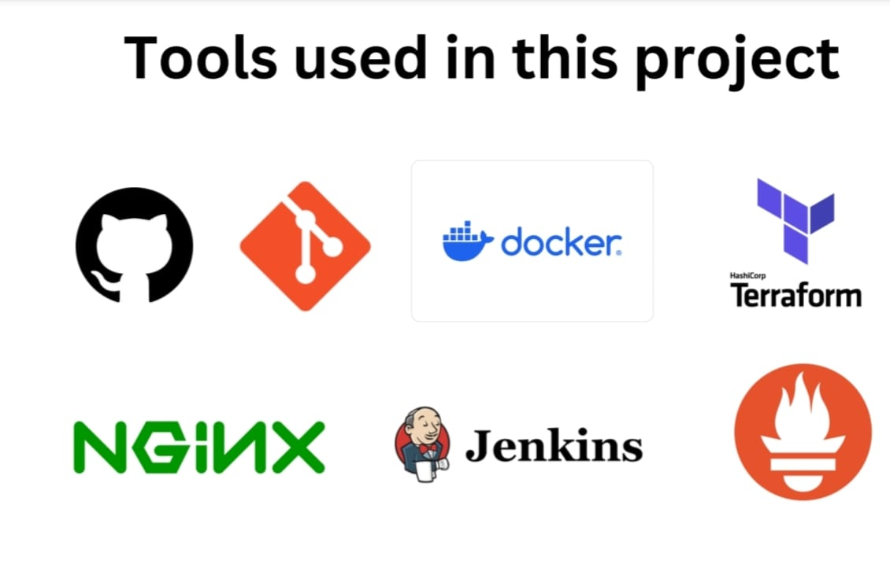

# E-Commerce Project

This is a simple e-commerce webpage project built to demonstrate core **DevOps principles** and tools. The project includes frontend development with static assets and is served using **NGINX** as the backend. The infrastructure is managed using **Docker**, **Jenkins**, **Terraform**, and monitoring is implemented using **Prometheus**.

---

## **Project Overview**
- **Frontend:** HTML, CSS, JavaScript
- **Backend:** Initially Node.js and Express.js, later replaced with **NGINX** for static file serving.
- **DevOps Tools:**
  - **Docker**: Containerization for easy deployment.
  - **Jenkins**: CI/CD pipeline for automated builds and deployments.
  - **Terraform**: Infrastructure as Code (IaC) for cloud resource provisioning.
  - **Prometheus**: Monitoring and observability for the application's performance.

---

## **Project Features**
1. **Static Frontend**:
   - Responsive design using **Bootstrap**.
   - Links to external product catalogs (e.g., Amazon).
   - Dynamic rendering of product cards using JavaScript.
   
2. **Backend with NGINX**:
   - Serves static assets (HTML, CSS, JS) efficiently.
   - Configured for optimal performance and reliability.

3. **DevOps Workflow**:
   - Automated deployment using **Jenkins CI/CD pipelines**.
   - Dockerized application for consistent builds and deployments.
   - Infrastructure automation using Terraform for cloud resources.

4. **Monitoring with Prometheus**:
   - Monitor application uptime, response times, and resource usage.
   - Set up alerts for any performance degradation.

---




## **Project Structure**
```
Sample-E-Commers-Project/ 
├── index.html                          # Main HTML file for the webpage 
├── public/                             # Static assets 
  ├── styles.css                        # CSS styles 
  ├── script.js                         # JavaScript for dynamic rendering   
├── server.js                           # (Initially Node.js backend, now replaced by NGINX) 
├── Dockerfile                          # Docker configuration for containerizing the project 
├── Jenkinsfile                         # CI/CD pipeline configuration 
├── prometheus/                         # Prometheus configuration files │ 
├── prometheus.yml                      # Prometheus configuration file │ 
└── alerts.yml                          # Alerts configuration 
├── terraform/                          # Terraform scripts for cloud infrastructure │ 
  ├── main.tf                           # Main Terraform configuration file │ 
  ├── variables.tf                      # Variables for infrastructure parameters │ 
  └── outputs.tf                        # Outputs for infrastructure details 
└── README.md                           # Project documentation
```

---

## **Technologies Used**
### **Frontend**
- **HTML/CSS**: For creating a responsive UI.
- **JavaScript**: For dynamic rendering of content.
- **Bootstrap**: For responsive design and styling.

### **Backend**
- **NGINX**: Used as a static file server for the application.

### **DevOps Tools**
- **Docker**:
  - Containerized the application for easy portability and consistent environments.
- **Jenkins**:
  - Configured CI/CD pipelines for automated testing and deployments.
- **Terraform**:
  - Automates infrastructure setup, such as deploying servers or cloud resources.
- **Prometheus**:
  - Provides monitoring and observability for the application and infrastructure.

---

## **Setup Instructions**
Follow these steps to set up and run the project locally or on a server.

**Pre-Requities**
- Git Should be installed

```bash
yum install git -y
```

### **Clone the Repository**
```bash
git clone https://github.com/DevopsProjects05/Sample-E-Commers-Project.git
```
```bash
cd Sample-E-Commers-Project/
```
### **NGINX Setup**

 **Install NGINX**:
  ```bash
  sudo yum update -y
   ```
  ```
  sudo yum install nginx -y
  ```
  **Start the NGINX Service:**
  ```
  sudo systemctl start nginx
  ```
  ```
sudo systemctl enable nginx
```
- Verify NGINX is running:
 ```
 sudo systemctl status nginx
 ```
- Open your browser and navigate to your server's IP address (http://<your-server-ip>). You should see the default NGINX welcome page. 

## Configure NGINX to Serve Your Application

### Move Your Files to the NGINX Web Root:
- NGINX serves static files from `/usr/share/nginx/html` by default.

- Move your project files (HTML, CSS, and JS) to this directory:

**Move project files to the NGINX web root:**
  ```bash
  sudo mv * /usr/share/nginx/html/
  ```
#### Ensure the directory contains:

```
/usr/share/nginx/html/
├── index.html
├── public/
│   ├── styles.css
│   └── script.js
```
#### Edit the NGINX Configuration File (If you modify)

- Open the NGINX configuration file
```
sudo nano /etc/nginx/nginx.conf
```
- Modify the server block to point to your files:
```
server {
    listen 80;
    server_name localhost;

    root /usr/share/nginx/html;             # Path to your project files
    index index.html;                       # Default file to load

    location / {
        try_files $uri /index.html;         # Serve the application
    }

    location /public/ {
        root /usr/share/nginx/html;         # Serve static assets like CSS and JS
    }

    error_page 404 /404.html;               # Optional: Custom 404 page
}

```
- Save and exit (Ctrl+O, Enter, Ctrl+X).

#### Test the NGINX Configuration:

- Before reloading NGINX, ensure the configuration is correct:
```
sudo nginx -t
```
- If there are no errors, reload NGINX to apply the changes:
```
sudo systemctl reload nginx
```

### Open Firewall Ports

Ensure that port 80 (HTTP) is open to allow incoming traffic.

- **For AWS EC2:**

- Go to your EC2 instance's security group settings.
- Add an inbound rule to allow HTTP (port 80) traffic.

### Access Your Application

- Open your browser and navigate to http://your-server-ip:80
- Your finalized project should now be served by NGINX.